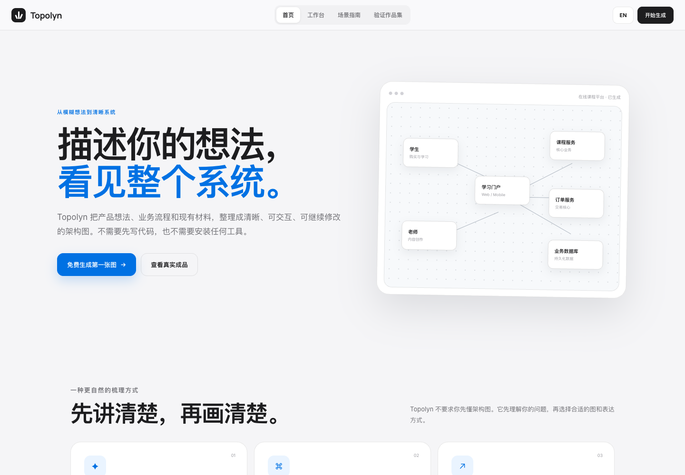

# Topolyn

**English** | [简体中文](README.zh-CN.md)

Current development version: `v2.16.0-dev.0`


<p align="center">
  
</p>

Actual screenshot of the local product website. The course-platform map on the homepage is a built-in example.

**Turn an idea, codebase or system description into a clear, interactive system map.**

This repository includes a product website with a conversational workspace, scenario guide and example gallery, alongside the Topolyn agent skill for Raven, Cursor, Claude Code, Codex CLI and OpenCode. The skill creates validated technical maps; the local web workspace offers a product-oriented way to describe, refine and export a system.

The core skill is implemented; stable-release acceptance is still in progress. See the [changelog](CHANGELOG.md#unreleased).

## Try the local product

Requires **Node.js 18 or later**.

```bash
git clone https://github.com/chenjieliefu/Topolyn.git
cd Topolyn
node scripts/serve-topolyn-site.mjs
```

The launcher opens the local site, normally at `http://127.0.0.1:4173/`. On macOS, you can also double-click `启动Topolyn.command`. Keep the terminal running while using the site and press **Ctrl+C** to stop it.

Browse the homepage, open the workspace, describe a product or choose a sample, inspect the generated nodes, continue the conversation and export the result. The product interface supports Chinese and English.

The local server can use a server-side `DEEPSEEK_API_KEY`. Without a configured key it uses built-in browser demonstration data; a working demo is not evidence of a live model response. Never put an API key in a public README or frontend bundle.

## Install the agent skill

```bash
npx skills add chenjieliefu/Topolyn -g
```

For an explicit, non-interactive Cursor installation:

```bash
npx -y skills add chenjieliefu/Topolyn --skill topolyn --agent cursor --global --copy --yes
```

Raven uses manual ZIP installation: extract `topolyn.zip` into `~/.raven/workspace/skills`, which yields `~/.raven/workspace/skills/topolyn`.

See the [English skill guide](SKILL_GUIDE_EN.md) for detailed commands, export options and verified examples.

Then ask your agent:

```text
Analyze this repository and use Topolyn to map its high-level runtime architecture.
Keep 8–12 core components, highlight the main path, and identify external dependencies and trust boundaries.
```

Or describe a flow directly:

```text
Use Topolyn to show this login flow:
Browser -> Web App -> API -> JWT validation -> Redis session lookup -> PostgreSQL fallback.
```

Continue with requests such as “add Redis,” “move authentication to the left,” or “highlight the rollback path.”

## What the skill can do

- Read a repository or bounded system description and structure the important relationships.
- Generate architecture, workflow, sequence, dataflow and lifecycle diagrams.
- Validate typed JSON, layout, paths and labels with deterministic rules.
- Search nodes, inspect relationships, trace upstream/downstream connections and follow selected routes.
- Compare two versions to see additions, removals, modifications and movement.
- Deliver standalone HTML, PNG, SVG, WebM and share cards.

The default generated artifact is a self-contained HTML file that can be opened without a hosted service. The local web workspace and the full skill have different capabilities; the skill's full export and validation feature set should not be inferred from the homepage demo.

## Diagram types

| Type | Best for |
|---|---|
| Architecture | Components, services, storage, boundaries and dependencies |
| Workflow | CI/CD, approvals, tool calls and operational processes |
| Sequence | API calls, authentication, cache fallback and asynchronous interaction |
| Dataflow | Pipelines, lineage, sensitive data and consumers |
| Lifecycle | State transitions, retries, waiting and terminal outcomes |

```bash
node topolyn/bin/topolyn.mjs guide "Show an API request and a Redis cache miss"
```

## Generated viewer preview


This checked-in example shows the generated viewer's role comparison, guided views and export controls. More examples are available in the [upstream Proof Lab](https://tt-a1i.github.io/archify/gallery.html).

## Workflow

| Step | What happens |
|---|---|
| Generate | The agent turns source evidence or a description into structured JSON |
| Validate | Rules check structure, layout, routes and labels |
| Preview | Inspect the latest validated result locally when needed |
| Deliver | Produce standalone HTML and optional exports |
| Refine | Apply a follow-up request while preserving unrelated structure |

Maps represent relationships grounded in their source or input. An authored connection is not automatically a verified runtime-impact claim.

## Development checks

```bash
cd topolyn
npm install
npm test
node bin/topolyn.mjs doctor
```

Useful commands from the `topolyn/` directory:

```bash
node bin/topolyn.mjs demo /tmp/topolyn-demo
node bin/topolyn.mjs guide "Show CI/CD checks, approval, deployment and rollback"
node bin/topolyn.mjs validate workflow examples/agent-tool-call.workflow.json --quality showcase --json
```

## Scope and documentation

Hosted sharing, WYSIWYG editing and arbitrary Mermaid conversion are not currently provided by the core skill.

- [Skill instructions](topolyn/SKILL.md)
- [Schema reference](topolyn/schemas/README.md)
- [Product definition](PRODUCT.md)
- [Changelog](CHANGELOG.md)
- [Roadmap](ROADMAP.md)
- [Contribution guide](CONTRIBUTING.md)
- [Upstream scenario guide](https://tt-a1i.github.io/archify/guide.html)
- [Upstream project and examples](https://tt-a1i.github.io/archify/)

## Credits and license

This repository builds on the [upstream Archify / Topolyn project](https://github.com/tt-a1i/archify) and includes local product-site and workspace adaptations. Upstream documentation and gallery links above refer to that original project.

Licensed under [MIT](LICENSE).
